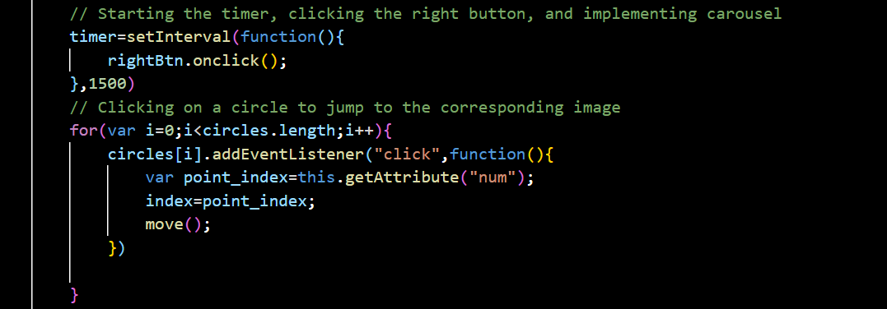

# Assignment report

## Website design and Quiz application

This project is a simple personal website, including my introduction, personal information and an interactive Quiz application. The website contains three pages: Introduction, About and Quiz. The Introduction page provides a brief introduction of my basic information, including name, school, major, and contact details. The About page provides more detailed information about me, including studies and interests. The Quiz page is an interactive quiz application where users can answer a series of questions and get the final results and rankings.

The Quiz app consists of ten questions, each with four choices. The user selects an answer within 15 seconds of the specified time. If the answer is not selected before the end of the time, the answer is deemed to be incorrect. After the user has completed all the questions, the system will display their score and total time, and list the leadboard with top 10 users.

## Introduction Page and Nav Design

### HTML Design ###
Navigation Bar: The nav element creates a simple navigation bar with links to the other two pages of the website. The currently active page is highlighted with a different color(Blue).  
 
Main Content Area: The div id="main" is the main container for the page content, divided into two sections:  
Left Section: Contains personal information, including a personal picture, name, university, interests, Email and Github link.  
Right Section: Contains a brief introduction, personal background, and additional details such as hobbies and career goals.  
### CSS Design ###
General Reset: The * selector resets margins and paddings for all elements to ensure consistency across different browsers.  
Body Styling: Flexbox is used to center the main content and ensure it occupies the full height of the viewport with a consistent background color.  
Navigation Styling: The navigation bar is styled to have a fixed height, background color, and alignment. Hover effects are added to enhance interactivity.  
 
Main Content Styling: The main content area is styled with padding, background color, and box-sizing to ensure proper spacing and layout. The left and right sections are floated for a side-by-side layout.  
Section Specific Styling: Both the left and right sections have specific styles for headings, paragraphs, images, and links to ensure a cohesive and visually appealing design.  
Footer Styling: A footer is included with a consistent background color, font size, and margin to match the overall design.

## About Page Design

### HTML Design ###
Navigation Bar and Main Content are the same as Introduction Page. But the right section is different.
Right Section: Provides a detailed description of academic interests and includes a circular display of a series of travel photographs.
Photo Display: Displays travel photos with navigation buttons and indicators, enhancing visual appeal.  

### CSS Design ###
Styling: Uses a consistent color scheme of blues and grays, providing a retro style, like a computer interface from the last century. Text styling ensures readability and visual hierarchy.  
Responsiveness: The layout is designed to be responsive, ensuring it looks good on various devices.
### Carousel Function ###
I implement tramform.js which is responsible for a carousel image slider. It contains seven parts:  

1. Initialization: When the window loads, the script fetches the necessary DOM elements such as the images (`items`), navigation circles (`circles`), left and right buttons (`leftBtn` and `rightBtn`), and the container (`content`) where the images are displayed. It also initializes variables like `index` to keep track of the current image index and `timer` for managing the automatic slide transition.  

2. Clearing Classes: The `clearclass` function removes all active classes from both the images and the navigation circles. This ensures that only the current image and its corresponding navigation circle are active at any given time.  

3. Move Function: The `move` function updates the classes of the current image and its corresponding navigation circle to make them active, thereby showing the current image and highlighting its navigation indicator.  

4. Button Click Event Handlers: Event listeners are attached to the left and right buttons. When the right button is clicked, it increments the `index` variable to move to the next image (if available), and then calls the `move` function to update the display accordingly. Similarly, when the left button is clicked, it decrements the `index` to move to the previous image and updates the display.  

5. Automatic Slide Transition: An interval timer (`timer`) is set to automatically click the right button every 1500 milliseconds (1.5 seconds), resulting in a continuous slideshow effect.  

6. Navigation Circle Click Event: Event listeners are added to each navigation circle. When a circle is clicked, its corresponding image is displayed by updating the `index` variable and calling the `move` function.  

7. Mouse Events: When the mouse hovers over the carousel (`content`), the automatic slide transition is paused by clearing the interval timer. Instead, a new interval timer is set to click the right button every 3000 milliseconds (3 seconds), allowing for a slower slideshow while the mouse is over the carousel. When the mouse leaves the carousel, the automatic slide transition resumes with the original interval of 1500 milliseconds.  

## Quiz Application Design

This part contains four files, quiz.html and quiz.css response for the page layouts and display, quiz.js and server.js response for communication between client and server, It mainly about functions for performing the complete quiz flow, leaderboard and the data transfer based on socket.io library.

### HTML Design ###
It includes a start screen where users can input their name before starting the quiz.
The quiz screen displays questions, options, a timer, and a button to proceed to the next question.
After completing the quiz, the result screen shows the user's score, time taken and a leaderboard.
### CSS Design ###
1. Options Container:
- It employs flexbox (`display: flex`) to arrange the options vertically (`flex-direction: column`).
- Options are centered horizontally (`align-items: center`) within the container.
- A cursor pointer (`cursor: pointer`) is set to indicate interactivity when hovering over options.
2. Start Screen:
- The background color (`background-color: #4B7C99`) provides visual contrast and distinction from the quiz questions.
- A subtle box shadow (`box-shadow`) is added to create depth and dimension, enhancing the visual appeal of the start screen.
3. Labels, Inputs, and Buttons:
- Buttons (`#start-screen button`) are styled with appropriate padding, font size, colors, border, and border radius.
- A cursor pointer is applied to buttons for indicating interactivity (`cursor: pointer`).
- A hover effect (`:hover`) changes the background color of buttons, providing visual feedback to users when hovering over them.

### Quiz and Server Design ###
Quiz Design:

- Upon loading the quiz page, clients establish a WebSocket connection with the server.
- Client triggers the `startQuiz` function when the user starts the quiz, sending a `submit-quiz` event to the server, including the username and quiz data.
- As the user progresses through the quiz, the client triggers the `submitAnswer` function upon answering each question, sending a `submit-answer` event to the server, along with the selected answer index.
- The server listens for `submit-answer` events, processing the submitted answers in the `submitAnswer` function.
- After processing each answer, the server emits an `answer-result` event back to the respective client, indicating whether the answer was correct, handled by the `handleAnswerResult` function on the client side.
- Upon completing the quiz, the client triggers the `endQuiz` function, sending a `submit-quiz` event to the server with the final quiz results.
- The server updates the leaderboard based on the submitted quiz results in the `submitQuiz` function.
- After updating the leaderboard, the server emits an `update-leaderboard` event to all connected clients, providing the latest leaderboard data.
- 
Server Design:

- The server listens for incoming WebSocket connections from clients and logs each connection.
- Upon connection, the server sets up event listeners to handle quiz-related events, such as `submit-quiz` and `submit-answer`.
- When the server receives a `submit-quiz` event from a client, it processes the submitted quiz data, including answers and username, in the `submitQuiz` function.
- For each submitted answer (via `submit-answer` event), the server verifies the correctness and emits an `answer-result` event back to the client using the `handleAnswerResult` function.
- After receiving the final quiz results, the server updates the leaderboard data using the `updateLeaderboard` function.
- The leaderboard is sorted based on the number of correct answers and total time taken.
- Upon updating the leaderboard, the server emits an `update-leaderboard` event to all connected clients, providing the latest leaderboard data.
- When a client disconnects, the server handles the disconnection event and performs any necessary cleanup tasks.

### Client and server communication and event processing ###

In Quiz application, the client communicates with the server through the Socket.IO library. The client sends a request to the server when the quiz starts, and the server returns the quiz questions to the client. When the client receives the questions, it starts timing and displays the question and options. After the user selects the answer, the client sends the option index to the server for verification. Within the time limit for each question, if the user does not make a choice, the server determines that the answer is wrong. Finally, when all the questions have been answered, the client sends the user's score and total time to the server and requests that the leaderboard data be updated and displayed.

In terms of event processing, the client mainly deals with the interaction events between the user and the interface, such as clicking buttons and selecting options. The server is responsible for handling the requests sent by the client, including displaying questions, verifying answers, and updating leaderboard data.

## Challenge

During the development process, I encountered several challenges, some of the main challenges include:  

1. Design the website structure: The style, structure and layout of the website need to be carefully considered initially to ensure user friendliness and a good navigation experience. I spent some time thinking about the content of each page and the navigational relationship between them.  

2. Design the Photo Carousel: We need to adjust the margins to ensure that the images are displayed and adapted correctly across devices and screen sizes, and to seamlessly switch images to ensure that there are no abrupt jumps or flickers during the rotation.  

3. Handle Quiz logic: Develop interactive Quiz applications that take into account user actions and feedback. I need to make sure that users are able to answer questions smoothly and get timely feedback (correct or not). In addition, I had to deal with the user's time constraints and the logic of not choosing an answer.  

4. Communicate with the server: In Quiz application, in order to prevent the answer from being captured, we need to put the correct answer in the server segment, which requires communication with the server to obtain the question data and submit the result. I learned how to use the Socket.IO library to implement real-time communication between the client and server to update leaderboard data after the user completes the quiz.  

## Conclusion

After completing this project, I have gained a deeper understanding of website development and real-time communication technology. I learned how to design and implement a simple personal website, and mastered the method of real-time communication with the server. In the process of solving various challenges, I continued to learn and improve my programming skills, which laid a solid foundation for future project development.

## Referrence

1. [Socket.IO Documentation](https://socket.io/docs/)
